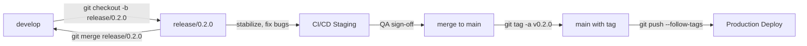
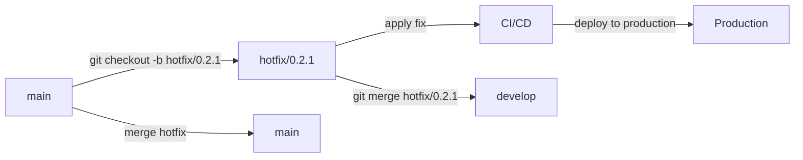

# Release Management — simple principles for all team members

This guide explains release workflows in plain language, with Git branch examples. It's designed for all team members, not just developers.

> **For developers**: See [`docs/release-management--js-tools.md`](../release-management--js-tools.md) for CI/CD configurations, automation scripts, and advanced troubleshooting.

## Overview

This guide covers:
- What release branches are and when to use them
- Simple Git commands for creating release and hotfix branches
- How releases move from development to production
- Best practices for versioning and changelog management

## Branch types

| Branch Pattern | Purpose                                        | Source    | Lifecycle                 |
|----------------|------------------------------------------------|-----------|---------------------------|
| `main`         | Production code; deployments triggered by tags | —         | Long-lived                |
| `develop`      | Integration branch for ongoing development     | —         | Long-lived                |
| `release/*`    | Stabilization branches for upcoming releases   | `develop` | Short-lived (1-2 weeks)   |
| `hotfix/*`     | Urgent production fixes                        | `main`    | Short-lived (fix + merge) |

### Branch naming conventions

**Use semantic versioning for release branches**:

- **Release branches**: `release/0.2.0` (e.g., `release/1.0.0`, `release/2.3.1`)
- **Hotfix branches**: `hotfix/0.2.1` (e.g., `hotfix/1.0.1`, `hotfix/2.3.2`)

**Examples**:
```bash
# Create release branch for version 0.2.0
git checkout -b release/0.2.0

# Create hotfix branch for version 0.2.1
git checkout -b hotfix/0.2.1
```

**Why use version-based naming?**
- Release branches match the version tags (e.g., `v0.2.0`)
- Easy to see which version you're working on
- Simplifies deployment and rollback

## Visual workflow diagrams

### Standard release flow



### Hotfix flow



## Recommended release workflow (example)

### Step 1: Create a release branch

Create a release branch from `develop` when features are complete and stabilization begins:

```pwsh
# Navigate to project root
cd /path/to/project

# Checkout develop and pull latest changes
git checkout develop
git pull origin develop

# Create release branch for version 0.2.0
git checkout -b release/0.2.0
```

### Step 2: Stabilize the release

Focus on bug fixes, documentation, and version updates:

```pwsh
# Fix critical bugs
git checkout -b hotfix/0.2.1
# ... make changes ...
git commit -am "fix: resolve login timeout issue"
git checkout release/0.2.0
git merge --no-ff hotfix/0.2.1

# Update version in package.json or config files
# Update CHANGELOG.md with release notes
# Run tests to ensure stability
```

### Step 3: Run CI and deploy to staging

Configure a GitHub Actions job or CI pipeline for staging deployment:

```yaml
# .github/workflows/release-staging.yml
name: Release to Staging

on:
  push:
    branches:
      - 'release/*'

jobs:
  release-staging:
    runs-on: ubuntu-latest
    steps:
      - uses: actions/checkout@v4

      - name: Build artifacts
        run: npm run build

      - name: Run tests
        run: npm test

      - name: Deploy to staging
        run: |
          npm run deploy:staging
```

### Step 4: QA sign-off and merge to main

After QA validation, merge to main and create an annotated tag:

```pwsh
# Checkout main and pull latest
git checkout main
git pull origin main

# Merge release branch
git merge --no-ff release/0.2.0 -m "Merge release 0.2.0 stabilization branch"

# Create annotated tag with version and message
git tag -a v1.2.0 -m "Release v1.2.0 - Bugfixes and performance improvements"

# Push tag and branch to trigger production deployment
git push origin main --follow-tags
```

### Step 5: Reintegrate into develop

Merge the release back into `develop` to preserve fixes:

```pwsh
# Checkout develop
git checkout develop
git pull origin develop

# Merge release branch back
git merge --no-ff release/0.2.0 -m "Merge release 0.2.0 back into develop"

# Push to origin
git push origin develop
```

### Step 6: Clean up release branch

Delete the release branch locally and remotely (optional but recommended):

```pwsh
# Delete locally
git branch -d release/0.2.0

# Delete remotely
git push origin --delete release/0.2.0
```

## Hotfix flow

For urgent production issues requiring immediate fixes:

```pwsh
# 1. Create hotfix branch from main
git checkout main
git pull origin main
git checkout -b hotfix/0.2.1

# 2. Apply the fix
# Edit files, add tests, commit
git commit -am "fix: critical bug in authentication"

# 3. Merge to main and tag
git checkout main
git merge --no-ff hotfix/0.2.1 -m "Merge hotfix 0.2.1"
git tag -a v1.2.1 -m "Hotfix v1.2.1 - Critical bug fix"
git push origin main --follow-tags

# 4. Merge back to develop
git checkout develop
git merge --no-ff hotfix/0.2.1 -m "Merge hotfix 0.2.1 back into develop"
git push origin develop

# 5. Clean up
git branch -d hotfix/0.2.1
git push origin --delete hotfix/0.2.1
```

## Recommended release workflow (example)

1. Create a release branch from `develop` when feature-complete:

```pwsh
git checkout develop
git pull origin develop
git checkout -b release/1.2.0
```

2. Stabilize: fixes, docs, bump version, update changelog.

3. Run full CI and deploy to staging for QA. Example: GitHub Actions job `release-staging`.

4. After QA sign-off, merge to `main`, tag and push the tag. Use annotated tags:

```pwsh
git checkout main
git pull origin main
git merge --no-ff release/1.2.0 -m "Merge release 1.2.0"
git tag -a v1.2.0 -m "Release v1.2.0"
git push origin main --follow-tags
```

5. Merge the release back into `develop` to keep fixes:

```pwsh
git checkout develop
git merge --no-ff release/1.2.0 -m "Merge release 1.2.0 back into develop"
git push origin develop
```

6. Delete the release branch (optional):

```pwsh
git branch -d release/1.2.0
git push origin --delete release/1.2.0
```

## Hotfix flow

For production issues:

```pwsh
git checkout main
git pull origin main
git checkout -b hotfix/1.2.1
# apply fix, commit
git commit -am "fix: critical bug"
git checkout main
git merge --no-ff hotfix/1.2.1
git tag -a v1.2.1 -m "Hotfix v1.2.1"
git push origin main --follow-tags
git checkout develop
git merge --no-ff hotfix/1.2.1
git push origin develop
```
